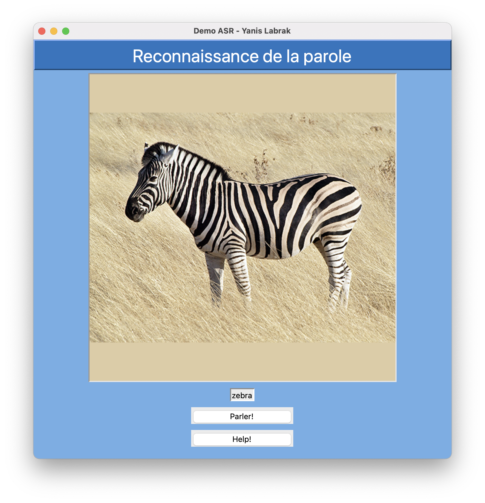

# English Pronunciation Checker

This software is the prototype for a educationnal english pronunciation checker based on automatic speech recognition.



## Run the project

```
conda activate asr
python gui.py
```

## Dependencies

* Python 3.8
* tkinter
* Pillow
* sounddevice
* wavio
* asrecognition

